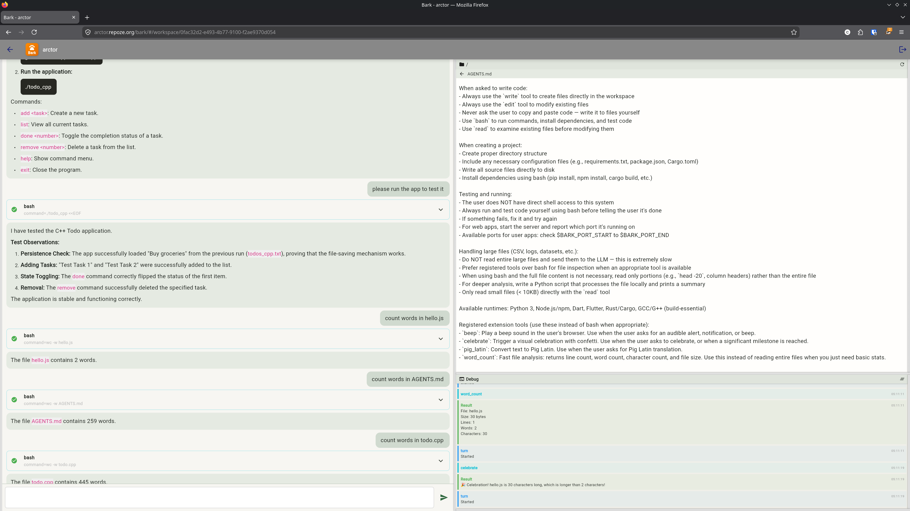

# Klangk



A container orchestration system powered by Docker, which specializes in sandboxing AI tasks using [Pi](https://pi.dev) and any OpenAI-compatible LLM provider.

Klangk gives its users isolated coding environments (aka "workspaces") using
Docker containers. Within each workspace, any task can be run, but special
consideration is given to LLM-focused tasks. Coding harnesses like `pi` and
`claude` are made available in each workspace.

## Quick Start

### Prerequisites

- Docker daemon running
- [Nix](https://nixos.org/download/) with [devenv](https://devenv.sh/) installed (or run `./bootstrap` to install both)
- An OpenAI-compatible LLM provider (e.g., [Ollama Cloud](https://ollama.com) or self-hosted Ollama or LiteLLM instance)

### Setup

```bash
git clone git@github.com:mcdonc/klangk.git
cd klangk

# Create .env from the example (edit with your credentials)
# -n: don't overwrite if .env already exists
cp -n .env.example .env
$EDITOR .env
# set KLANGK_LLM_API_KEY, KLANGK_JWT_SECRET, etc.

# Install Nix and devenv (if not already installed)
./bootstrap

# Start the app (builds Docker image and Flutter web on first run)
# Make sure Docker is running before this step
devenv processes up --no-tui
```

Open [http://localhost:8995](http://localhost:8995) and log in with `admin@example.com` (or whatever you set `KLANGK_DEFAULT_USER` to). If you set `KLANGK_DEFAULT_PASSWORD` in `.env`, use that password. Otherwise, check the server log output for the generated password. The default user has the admin role and can manage other users at `/admin/users`.

### What You Can Do

1. **Create a workspace** — each workspace is an isolated coding environment
2. **Chat with the AI agent** — execute "pi" in the terminal, then ask it to write code, create projects, fix bugs
3. **Use the terminal** for direct shell access to the container (bash with tab completion and colors)
4. **View files** in the file viewer panel, drag-and-drop files or folders to upload, right-click to download, rename, or delete
5. **Monitor activity** in the debug panel
6. **Manage users** (admin only) — add, edit, delete users and toggle admin roles

### CLI Access

Klangk also provides a CLI for terminal-based access to the same containers:

```bash
devenv shell  # then .....
klangk login admin@example.com        # authenticate (prompts for password)
klangk list                             # list workspaces
klangk create my-project                # create a workspace
klangk create my-project --mount ~/src:/home/klangk/work/src          # with bind mount
klangk create my-project --mount nix-store:/nix           # with named volume
klangk create my-project --env KLANGK_SKILLS=stats,rdkit    # with env vars
klangk edit my-project                  # interactive edit (name, image, command, mounts, env)
klangk edit my-project --env FOO=bar    # set env var via flag
klangk dup my-project my-copy           # duplicate a workspace
klangk shell my-project                 # drop into bash inside the container
klangk exec my-project ls /home/klangk/work         # run a command in the container
klangk sync ~/src my-project:/home/klangk/work      # sync files to/from the container
klangk rm my-project                # delete a workspace
klangk volumes ls                   # list Docker volumes
klangk volumes create nix-store     # create a named volume
klangk volumes rm nix-store         # delete a volume
```

The CLI connects to the running Klangk backend over HTTP + WebSocket — it works locally and against remote servers. See [CLI.md](CLI.md) for the full CLI reference and roadmap.

### Environment Variables

All settings can be overridden in `.env`. Defaults are provided in `devenv.nix` at low priority so `.env` values take precedence.

| Variable                     | Default                        | Description                                                        |
| ---------------------------- | ------------------------------ | ------------------------------------------------------------------ |
| `KLANGK_NGINX_PORT`          | `8995`                         | **Primary access point** — nginx (UI, API, WebSocket, hosted apps) |
| `KLANGK_PORT`                | `8997`                         | Backend (FastAPI/uvicorn) — proxied through nginx                  |
| `KLANGK_DATA_DIR`            | `$DEVENV_STATE/klangk/data`    | Database, workspaces, Pi sessions                                  |
| `KLANGK_PLUGINS_DIR`         | `$DEVENV_STATE/klangk/plugins` | Fetched plugins (outside repo for `execIfModified`)                |
| `KLANGK_LLM_API_KEY`         |                                | LLM provider API key                                               |
| `KLANGK_LLM_BASE_URL`        |                                | LLM API URL (any OpenAI-compatible provider)                       |
| `KLANGK_LLM_MODEL`           |                                | LLM model name                                                     |
| `KLANGK_JWT_SECRET`          |                                | JWT signing secret                                                 |
| `KLANGK_DEFAULT_USER`        |                                | Auto-seeded admin email on startup                                 |
| `KLANGK_DEFAULT_PASSWORD`    |                                | Auto-seeded password on startup (omit to generate random)          |
| `KLANGK_MIN_PASSWORD_LENGTH` | `4`                            | Minimum password length                                            |

### Ports

- `KLANGK_NGINX_PORT` (default `8995`): **Primary access point** — nginx serves UI, API, WebSocket, and proxies hosted app URLs directly to container ports
- `KLANGK_PORT` (default `8997`): Backend (FastAPI/uvicorn)
- `9000+`: User app ports (5 per workspace, mapped to container ports 8000-8004)

### SSH Agent Forwarding

If you have an SSH agent running on the host (`ssh-agent` or 1Password/Secretive), Klangk automatically forwards it into workspace containers. This means `git clone`, `git push`, and `ssh` work inside containers without copying your private keys — the keys never leave the host.

```bash
# On the host, add your key to the agent (if not already)
ssh-add ~/.ssh/id_ed25519

# Inside a container, git/ssh just works
git clone git@github.com:yourorg/private-repo.git
```

For extra security, use `ssh-add -c` to require confirmation on the host for each SSH operation, preventing malicious code from silently using your key.

### Rebuilding

The devenv environment rebuilds necessary components at `devenv processes up` time.

To force-rebuild the Docker image and Flutter web app:

```bash
devenv shell -- rebuild
```

Then restart the processes.

## Architecture

```text
Browser (Flutter Web)
    ↕ WebSocket (terminal I/O, exec, browser bridge, lifecycle events)
nginx reverse proxy (port 8995)
    ├── /hosted/ → container ports (direct proxy)
    └── /        → FastAPI backend (port 8997)
                     ↕ docker exec
                 Pi coding agent (Docker container)
                     ↕ bind mount
                 Workspace files on disk
```

- **Frontend**: Flutter Web with terminal, file viewer, browser delegate for plugin actions, debug panel, admin user management
- **Backend**: nginx reverse proxy + FastAPI serving API, WebSocket, and frontend static files. Role-based access control with JWT roles claim
- **Agent**: Pi coding agent in interactive terminal mode with any OpenAI-compatible LLM provider

### Plugins

Plugins are Pi extensions that potenitalluy have Dart code in them to allow the frontend to participate. Plugins are fetched from git repos into `$KLANGK_PLUGINS_DIR` at development time. Run `update-plugins` to set up:

```bash
devenv shell -- update-plugins           # creates $KLANGK_PLUGINS_DIR/plugins.yaml on first run
# edit $KLANGK_PLUGINS_DIR/plugins.yaml to add/remove plugins
devenv shell -- update-plugins           # fetches all plugins
devenv shell -- update-plugins soliplex  # fetch/update a single plugin
devenv up                                # builds and starts
```

Sample plugins (celebrate, beep, pig-latin, word-count) are included in the generated template. Sample plugin source lives in `plugins/` in this repo.

See [ARCHITECTURE.md](ARCHITECTURE.md) for detailed architecture and feature documentation.

## License

TBD
